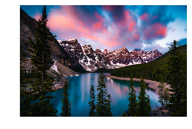
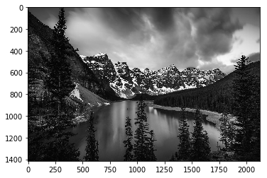
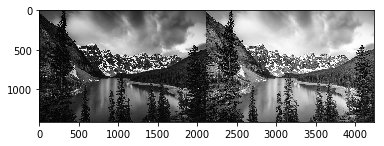
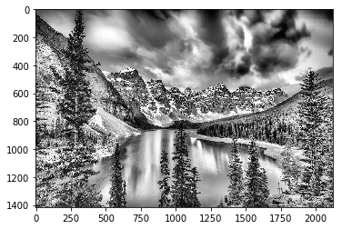
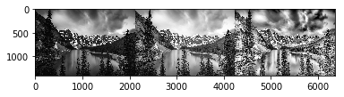
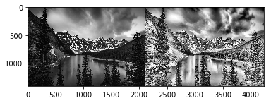

```python
import cv2
import matplotlib.pyplot as plt
import numpy as np
#import sys
%pylab inline
```

    Populating the interactive namespace from numpy and matplotlib
    


```python
"""
function to change the cv2 color scheme from BGR to RGB
"""
def TurnRGB(image_or_frame): 
    return cv2.cvtColor(image_or_frame, cv2.COLOR_BGR2RGB)
```


```python
"""
function to convert to grayscale
"""
def TurnGray(image_or_frame):
    return cv2.cvtColor(image_or_frame, cv2.COLOR_BGR2GRAY)
```


```python
"""
function to print grayscale images
"""
def ShowGray(image_or_frame):
    plt.imshow(image_or_frame, cmap='gray')
    plt.show() # this line is not necessary if we have the magic function %pylab
```


```python
"""
function to print RGB images
"""
def ShowColor(image_or_frame):
    RGB = cv2.cvtColor(image_or_frame, cv2.COLOR_BGR2RGB)
    plt.imshow(RGB)
    plt.show() 
```


```python
"""
loading the image
"""
loaded_image = cv2.imread('landscape.jpg')
#Direct_GrayScale_image = cv2.imread('landscape.jpg',0) # loading the image in grayscale
```


```python
Color_image = loaded_image
plt.axis("off")
ShowColor(loaded_image)
```





```python
#converting the image to grayscale
GrayScale_image = TurnGray(loaded_image)

#plt.axis('off') # to hide the axis of scale
ShowGray(GrayScale_image)

cv2.imwrite('Grayscale image.jpg',GrayScale_image)

# nice to know function
print("the height and width dimensions of the image")
height, width = loaded_image.shape[:2]

print (loaded_image.shape) # prints the image dimensions and color channel
print ('\n the above shape was for the loaded image below is for the gragscale version')
print (GrayScale_image.shape) # prints the image dimensions and color channel

print("\n total number of pixels")
print(GrayScale_image.size)

print("\n image data type")
print(GrayScale_image.dtype)
```





    the height and width dimensions of the image
    (1414, 2121, 3)
    
     the above shape was for the loaded image below is for the gragscale version
    (1414, 2121)
    
     total number of pixels
    2999094
    
     image data type
    uint8
    


```python
del loaded_image # to save memory
```


```python
plt.axis("off")
ShowColor(Color_image) 
```


## Histogram Equalization


```python
equ = cv2.equalizeHist(GrayScale_image)
cv2.imwrite('Equalized histogram image.jpg',equ)
res = np.hstack((GrayScale_image,equ)) #stacking images side-by-side

cv2.imwrite('Black & white image vs Equalized histogram.jpg',res)
```


    True


```python
ShowGray(res)
```





### CLAHE (Contrast Limited Adaptive Histogram Equalization)


```python
# create a CLAHE object (Arguments are optional).
clahe = cv2.createCLAHE()
#clahe = cv2.createCLAHE(clipLimit=2.0, tileGridSize=(8,8))
cl1 = clahe.apply(GrayScale_image)

cv2.imwrite('clahe image.jpg',cl1)
```


    True


```python
Clahed_image = cv2.imread('clahe_2.jpg',0)

ShowGray(cl1)
```





```python
res2 = np.hstack((GrayScale_image,equ,cl1)) #stacking images side-by-side

ShowGray(res2)

cv2.imwrite('Black & white vs Equalized histogram vs C.L.A.H.E.jpg',res2)
```





    True


```python
bc = np.hstack((GrayScale_image,cl1)) #stacking images side-by-side
ShowGray(bc)
cv2.imwrite('Black & white vs  C.L.A.H.E.jpg',bc)
```





    True


